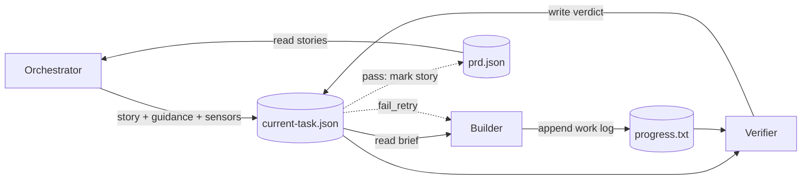

# Marmite

An autonomous build system that drives three agents in a loop to implement a project from a PRD. Works on greenfield apps and existing codebases alike — drop in a PRD, let it simmer.

Each iteration: the **orchestrator** picks the next story, runs health sensors, and briefs the builder. The **builder** implements the story and commits. The **verifier** reviews and emits a verdict. A plain **harness** advances state, retries on failure and checkpoints for crash recovery.

## Philosophy

A model tends to trust its own output, a fresh verifier has no attachment to the builder's plan, so it catches what's actually broken. When the verifier rejects, the builder resumes its original session to fix it, keeping context.

- Each agent has one job. Combining them produces agreeable mush.
- Agents do the creative work. A plain program handles state transitions, schema validation, `prd.json` writes, and crash recovery.
- Agents don't call each other. They read and write zod-validated files, so every handoff is inspectable and replayable.

## Architecture



| Phase | Agent | Writes | Purpose |
|---|---|---|---|
| ORCHESTRATE | Orchestrator (fresh) | `current-task.json` | Pick story, run sensors, brief builder |
| BUILD | Builder (fresh) | `progress.txt`, commit | Implement the story |
| VERIFY | Verifier (fresh) | `current-task.json` verdict | Approve or reject |
| FIX | Builder (resumes) | commit | Address verifier feedback |

`current-task.json` is the single handoff file between agents. The orchestrator writes the story, guidance, and a `sensorSummary`; the verifier merges in the verdict. The harness reads it after each phase to drive state transitions.

The harness is the only writer of `prd.json` — it flips `passes: true` and commits on pass. Generated code lives under `app/`.

## Install

Requires [Bun](https://bun.sh).

```bash
git clone <repo> && cd marmite
bun install
export ANTHROPIC_API_KEY=sk-ant-...
```

## Setup

Marmite works on **greenfield projects** and **existing codebases**. For an existing project, the PRD describes the next batch of stories to implement — the agents will read the existing code and carry on from there.

### 1. Write the PRD

The PRD is the source of truth for what to build. Stories have `id`, `priority` (lower = higher priority), `description`, `acceptanceCriteria`, and a `passes` flag the harness flips as stories land.

- Draft the spec then convert to `prd.json` with `/to-prd`.
- Place the file at the repo root (or point to it with `--prd`).
- For an existing project, write stories for the features or improvements you want — the agents will read the existing code as context.

To generate `prd.json` from an existing markdown spec:

```bash
echo "/to-prd @docs/PRD.md" | claude --print --model claude-opus-4-7 --dangerously-skip-permissions
```

### 2. Tune the agent prompts

The three prompts in `.harness/prompts/` are project-agnostic defaults. Edit them to bake in stack choices, house style, and any workflow rules specific to your app. For existing projects, add context about the current architecture, conventions, and areas to avoid:

- `orchestrator-prompt.md` — story selection heuristics, when to run sensors, how to brief the builder.
- `builder-prompt.md` — stack, commit conventions, testing requirements, `progress.txt` format.
- `verifier-prompt.md` — how strictly to interpret acceptance criteria, what counts as `fail_retry` vs `fail_abort`.

### 3. Configure sensors (optional but recommended)

Sensors are deterministic health checks (linters, type checker, tests, audits) the orchestrator runs selectively to feed objective feedback to the builder.

```bash
cp sensors/sensors.example.json sensors/sensors.json
```

Each entry:

```json
{
  "name": "eslint",
  "type": "debt",
  "command": "bun run lint",
  "description": "Code quality debt",
  "guidance": "Setup: copy `eslintrc.json` next to `app/package.json`. Run the `clean-code` skill to address violations."
}
```

The four standard `type`s map to suggested skills the orchestrator recommends to the builder when the sensor fails:

| Type | Purpose | Typical tool | Suggested skill |
|------|---------|--------------|-----------------|
| `drift` | Import violations, circular deps, layer misuse | dependency-cruiser | `architect` |
| `debt` | Style, complexity, unused code, type errors | eslint, tsc | `clean-code`, `refactor` |
| `pulse` | Failing or flaky tests | jest, vitest | `debug` |
| `safe` | Known CVEs in the dependency tree | npm audit, snyk | `security-review` |

The `guidance` string carries both setup instructions (which config files to copy where) and remediation advice. The orchestrator reads it before briefing the builder, so first-time setup happens automatically.

Drop supporting config files (e.g. `eslintrc.example.json`, `dependency-cruiser.example.json`) in `sensors/` — agents copy them into `app/` on demand per `guidance`.

The orchestrator runs sensors when a story just failed verification, every 3rd completed story, or when `progress.txt` shows accumulating issues.

### 4. (Optional) Harness config

Override defaults in `harness.config.json` — see `harness.config.example.json` for the schema (models, timeouts, retries, cost budgets).

## Run

```bash
bun cook                                                  # default: 1000 iterations, claude-opus-4-7
bun cook -n 5                                             # custom iteration count
bun cook --prd ./x.json
bun cook --model claude-opus-4-7 --cost-budget 10         # per-story cap (USD)
bun cook --cost-budget-total 100                          # total run cap; halts when exceeded
bun cook --builder-model claude-opus-4-7 --verifier-model claude-sonnet-4-6
bun cook --config ./harness.config.json
bun cook --no-resume                                      # ignore existing .harness/state.json
```

## Operational notes

- `.harness/state.json` checkpoints after every phase; `--resume` (default) picks up a matching PRD + branch.
- Transient errors (429, 5xx, network) retry with exponential backoff; fatal errors abort the iteration.
- Per-story cost cap halts remaining fix attempts; total-run cap halts before the next iteration.
- When the PRD branch changes, prior `prd.json` + `progress.txt` move to `archive/YYYY-MM-DD-branchname/`.
- All protocol files are written atomically (temp + rename).
