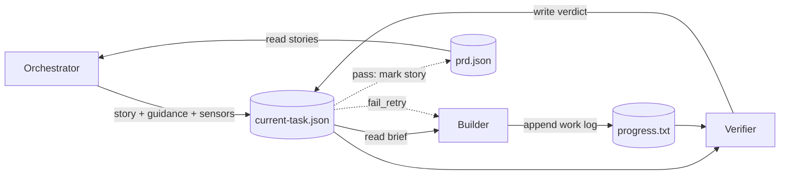

# Marmite

A harness that drives three agents in a loop to implement a project from a PRD. Works on greenfield apps and existing codebases alike — drop in a PRD, let it simmer.

Each iteration: the **orchestrator** picks the next story, runs health sensors, and briefs the builder. The **builder** implements the story and commits. The **verifier** reviews and emits a verdict. A plain **harness** advances state, retries on failure and checkpoints for crash recovery.

## Quickstart

Requires [Bun](https://bun.sh) and the [Claude CLI](https://docs.claude.com/en/docs/claude-code).

```bash
export ANTHROPIC_API_KEY=sk-ant-...
bunx marmite init     # interactive wizard — asks the right questions and writes config
bunx marmite cook     # start the agent loop
```

`marmite init` runs a Claude Code skill that interviews you. It detects whether your repo is greenfield or has existing code, and points sensors at configs you already have. Nothing gets overwritten without your confirmation.

For per-project install:

```bash
bun add -D marmite
bun marmite cook
```

## Philosophy

A model tends to trust its own output, a fresh verifier has no attachment to the builder's plan, so it catches what's actually broken. When the verifier rejects, the builder resumes its original session to fix it, keeping context.

- Each agent has one job.
- The harness handles state transitions, schema validation, `prd.json` writes, and crash recovery.
- Agents communicate through zod-validated files, so every handoff is inspectable and replayable.

## Architecture



| Phase | Agent | Writes | Purpose |
|---|---|---|---|
| ORCHESTRATE | Orchestrator | `current-task.json` | Pick story, run sensors, brief builder |
| BUILD | Builder | `progress.txt`, commit | Implement the story |
| VERIFY | Verifier | `current-task.json` verdict | Approve or reject |
| FIX | Builder | commit | Address verifier feedback |

`current-task.json` is the single handoff file between agents. The orchestrator writes the story, guidance, and a `sensorSummary`; the verifier merges in the verdict. The harness reads it after each phase to drive state transitions.

Generated code lives where `marmite.json`'s `app` field points (default `./app`).

## Project layout after init

```
my-project/
├── package.json          # marmite in devDependencies (if installed locally)
├── marmite.json          # your config — paths, sensors, models, budgets
├── prd.json              # the PRD that drives the loop
├── .marmite/
│   ├── prompts/          # optional prompt overrides (checked in)
│   ├── state.json        # gitignored — crash-recovery checkpoint
│   └── events.jsonl      # gitignored — per-session event log
└── app/ or apps/web/…    # your code (lint configs live where they always have)
```

## Configuration

`marmite.json` is JSONC. Every field is optional; the example below shows the full surface area.

```jsonc
{
  "app": "./app",                  // where application code lives
  "prd": "./prd.json",             // the PRD that drives the loop

  // Sensors — deterministic checks the orchestrator runs between stories.
  // configPath points at an existing config anywhere in the repo (no copying).
  // guidance is freeform prose passed to the agent invoking the sensor.
  "sensors": [
    {
      "name": "eslint",
      "type": "debt",
      "package": "eslint",
      "configPath": "./app/.eslintrc.json",
      "guidance": "Run via `bun run lint:strict` in the app workspace."
    },
    {
      "name": "tsc",
      "type": "pulse",
      "package": "typescript",
      "configPath": "./app/tsconfig.json",
      "guidance": "Use `bun run typecheck` so workspace refs resolve."
    }
  ],

  "models": {
    "default": "claude-sonnet-4-6",
    "builder": "claude-sonnet-4-6",
    "verifier": "claude-haiku-4-5",
    "orchestrator": "claude-sonnet-4-6"
  },

  "timeouts": { "build": "20m", "verify": "10m", "fix": "15m", "orchestrate": "10m" },
  "budget":   { "perStory": 15, "total": 100 },
  "retries":  { "fix": 3, "transient": 2 },
  "maxIterations": 1000,
  "resume": true
}
```

The four sensor `type`s map to suggested skills the orchestrator recommends to the builder when the sensor fails:

| Type | Purpose | Typical tool | Suggested skill |
|------|---------|--------------|-----------------|
| `drift` | Import violations, circular deps, layer misuse | dependency-cruiser | `architect` |
| `debt` | Style, complexity, unused code, type errors | eslint, tsc | `clean-code`, `refactor` |
| `pulse` | Failing or flaky tests | jest, vitest | `debug` |
| `safe` | Known CVEs in the dependency tree | npm audit, snyk | `security-review` |

## Customizing prompts

The three prompts in `src/prompts/` (`builder-prompt.md`, `verifier-prompt.md`, `orchestrator-prompt.md`) ship with the package. To override one, drop a file with the same name into `.marmite/prompts/` in your project — marmite reads the override if it exists, otherwise falls back to the default. Overrides are checked in.

## Run

```bash
marmite cook                                              # default: 1000 iterations
marmite cook -n 5                                         # custom iteration count
marmite cook --prd ./x.json
marmite cook --model claude-opus-4-7 --cost-budget 10     # per-story cap (USD)
marmite cook --cost-budget-total 100                      # total run cap; halts when exceeded
marmite cook --builder-model claude-opus-4-7 --verifier-model claude-sonnet-4-6
marmite cook --config ./marmite.json
marmite cook --no-resume                                  # ignore existing .marmite/state.json
```

`marmite` and `marmite cook` are equivalent — the `cook` subcommand is optional.

## Operational notes

- `.marmite/state.json` checkpoints after every phase; `--resume` (default) picks up a matching PRD + branch.
- Transient errors (429, 5xx, network) retry with exponential backoff; fatal errors abort the iteration.
- Per-story cost cap halts remaining fix attempts; total-run cap halts before the next iteration.
- When the PRD branch changes, prior `prd.json` + `progress.txt` move to `archive/YYYY-MM-DD-branchname/`.
- All protocol files are written atomically (temp + rename).

## Contributing / developing marmite itself

```bash
git clone <repo> && cd marmite
bun install
```

There is no `app/` in this repo — marmite is a harness, not an application. To test changes end-to-end, run `bunx --bun ./index.ts init` in a separate scratch directory (or `bun link` and then `marmite init`), then `marmite cook` from that directory.

Harness internals live in `src/core/`. Default prompts live in `src/prompts/`. The setup wizard skill lives in `.claude/skills/marmite-init/`.
