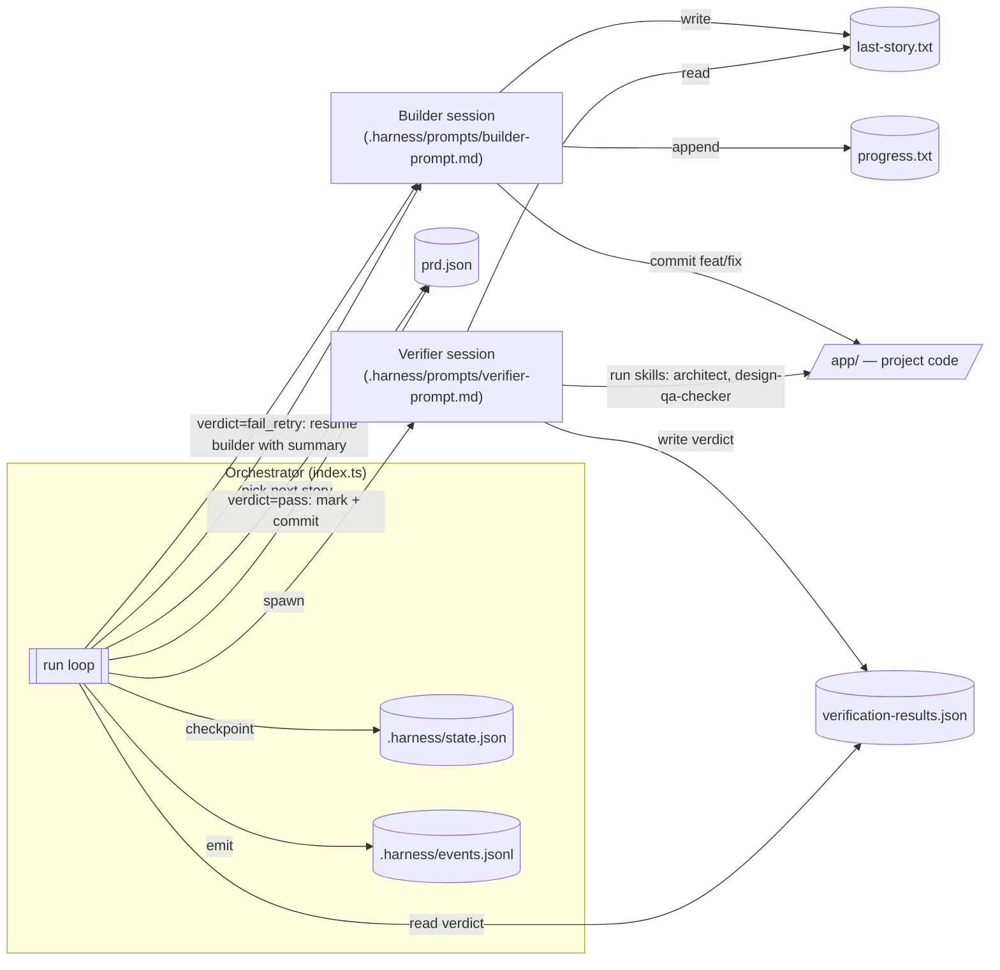

# Marmite

An autonomous build system that drives two Claude Code agents in a loop to implement a project from a PRD. Drop in a PRD, let it simmer. A builder agent picks the next failing user story, implements it, and commits. A verifier agent then reviews the work and emits a verdict. An orchestrator (a TypeScript program, not an agent) advances state, retries on `fail_retry`, and persists crash-recovery checkpoints.

## Architecture



### Roles

- Orchestrator: the deterministic TypeScript program at `.harness/core/orchestrator.ts` (entry point `index.ts`, started via `bun cook`). Not a Claude agent. It runs the outer loop, spawns builder and verifier as subprocesses, validates their output against zod schemas, and is the only writer of `prd.json`. It flips `passes: true` via `markStoryPassing` and creates the `verify: [Story ID] - passed verification` commit once the verifier returns `verdict: "pass"`.
- Builder: a Claude Code session spawned fresh per story. Implements code under `app/` and commits. Never touches `prd.json`.
- Verifier: a Claude Code session spawned fresh per verification. Reviews the builder's work and writes a verdict to `verification-results.json`. Never touches `prd.json` and never commits.

The split exists so the `passes` mutation is deterministic, schema-validated, and survives crashes via `.harness/state.json`, which is something an LLM agent can't reliably provide. Agents communicate through protocol files validated with zod schemas (`.harness/core/protocol.ts`, `.harness/core/prd.ts`, `.harness/core/state.ts`).

## Install

Requires [Bun](https://bun.sh). Clone and install:

```bash
git clone <repo>
cd marmite
bun install
```

Set your Anthropic API key:

```bash
export ANTHROPIC_API_KEY=sk-ant-...
```

## Setup

1. Author a PRD. Place a `prd.json` at the repo root. See `CLAUDE.md` for the format. To generate one, use the `/prd` skill to draft a spec file, then `/ralph` to convert that spec into `prd.json`.
2. Configure prompts. `.harness/prompts/builder-prompt.md` and `.harness/prompts/verifier-prompt.md` drive the builder and verifier agents. Adjust for your project.
3. Set up the target project. All generated code lives under `app/`. Structure and stack are up to the target project.

## Run

```bash
bun cook                               # default: 1000 iterations, claude-opus-4-7
bun cook -n 5                          # custom iteration count
bun cook --prd ./x.json                # custom PRD
bun cook --model claude-opus-4-7 --cost-budget 10
bun cook --build-timeout 900000 --verify-timeout 600000
bun cook --no-resume                   # ignore existing .harness/state.json
```

See `bun cook --help` for all flags. `HARNESS_MODEL` and `HARNESS_COST_BUDGET` environment variables are honored.

## How it works

| Phase | Session | Writes | Purpose |
|---|---|---|---|
| BUILD | fresh | `last-story.txt`, `progress.txt`, commit | Implement one story |
| VERIFY | fresh | `verification-results.json` | Emit verdict against acceptance criteria |
| FIX | resumes build session | commit | Address verifier feedback |

- Fresh vs resume: build and verify always start a new session; fix attempts resume the build session with the verifier's summary as context.
- Timeouts: per-phase `AbortController`; SIGINT cancels cleanly.
- Retries: transient errors (429, 5xx, network) retried with exponential backoff; fatal errors abort the iteration.
- Cost budget: a per-story cap halts remaining fix attempts when exceeded.
- Resume: `.harness/state.json` checkpoints after every phase; `--resume` (default) picks up matching PRD + branch.
- Archive: prior `prd.json` + `progress.txt` move to `archive/YYYY-MM-DD-branchname/` when the PRD branch changes.
- Atomic writes: all protocol files go through `writeAtomic` (temp + rename).

See `CLAUDE.md` for the full protocol and schemas.
