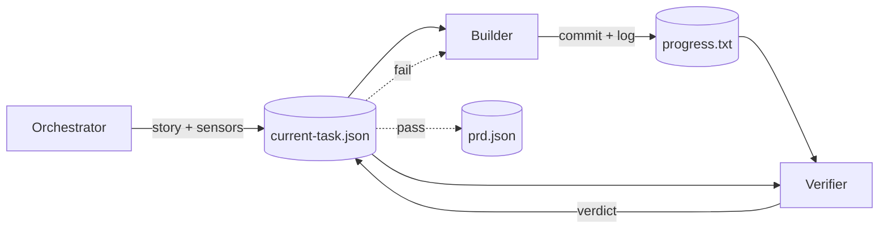

# Marmite

A harness that loops three agents (orchestrator, builder, verifier) to implement a project from a PRD. Works on greenfield or existing codebases.

The verifier reviews the builder's work without seeing the build session, which is the whole point: it has no investment in the plan, so it tends to catch what's actually broken. Agents hand off through zod-validated JSON files, so every step is inspectable and replayable.

## Install

Requires [Bun](https://bun.sh) and the [Claude CLI](https://docs.claude.com/en/docs/claude-code).

```bash
export ANTHROPIC_API_KEY=sk-ant-...
```

Run on demand with `bunx`:

```bash
bunx marmite init
bunx marmite cook
```

Or add to a project:

```bash
bun add -D marmite
bun marmite cook
```

## Setup

```bash
marmite init
```

This launches a Claude Code skill that interviews you, figures out whether your repo is greenfield or has existing code, and points sensors at configs you already have. It writes `marmite.json` and `prd.json`, and won't overwrite anything without asking.

After init, your project looks like:

```
my-project/
├── marmite.json          # config — paths, sensors, models, budgets
├── prd.json              # the PRD that drives the loop
├── .marmite/
│   ├── prompts/          # optional prompt overrides (checked in)
│   ├── state.json        # gitignored — crash-recovery checkpoint
│   └── events.jsonl      # gitignored — per-session event log
└── app/                  # your code (path is configurable)
```

## Run

```bash
marmite cook                                          # default: 1000 iterations
marmite cook -n 5                                     # custom iteration count
marmite cook --prd ./x.json
marmite cook --model claude-opus-4-7
marmite cook --cost-budget 10                         # per-story cap (USD)
marmite cook --cost-budget-total 100                  # halts when total exceeded
marmite cook --builder-model claude-opus-4-7 --verifier-model claude-sonnet-4-6
marmite cook --no-resume                              # ignore existing checkpoint
```

`marmite` and `marmite cook` are equivalent.

## Workflow



| Phase | Agent | Output |
|---|---|---|
| ORCHESTRATE | Orchestrator | Picks story, runs sensors, writes brief |
| BUILD | Builder | Implements story, commits |
| VERIFY | Verifier | Approves or rejects |
| FIX | Builder | Resumes session to address feedback |

`current-task.json` is the single handoff between agents. After every phase the harness checkpoints to `.marmite/state.json`, so `--resume` (default) picks up where the last run stopped.

## Configuration

`marmite.json` is JSONC. Every field is optional.

```jsonc
{
  "app": "./app",                  // where application code lives
  "prd": "./prd.json",

  "sensors": [
    {
      "name": "eslint",
      "type": "debt",
      "package": "eslint",
      "configPath": "./app/.eslintrc.json",
      "guidance": "Run via `bun run lint:strict` in the app workspace."
    },
    {
      "name": "tsc",
      "type": "pulse",
      "package": "typescript",
      "configPath": "./app/tsconfig.json",
      "guidance": "Use `bun run typecheck` so workspace refs resolve."
    }
  ],

  "models": {
    "default": "claude-sonnet-4-6",
    "builder": "claude-sonnet-4-6",
    "verifier": "claude-haiku-4-5",
    "orchestrator": "claude-sonnet-4-6"
  },

  "timeouts": { "build": "20m", "verify": "10m", "fix": "15m", "orchestrate": "10m" },
  "budget":   { "perStory": 15, "total": 100 },
  "retries":  { "fix": 3, "transient": 2 },
  "maxIterations": 1000,
  "resume": true
}
```

### Sensors

Deterministic checks the orchestrator runs between stories. `configPath` points at an existing config anywhere in the repo (nothing gets copied); `guidance` is freeform prose passed to the agent. Each `type` maps to a skill the orchestrator suggests to the builder when the sensor fails:

| Type | Purpose | Typical tool | Suggested skill |
|------|---------|--------------|-----------------|
| `drift` | Import violations, circular deps, layer misuse | dependency-cruiser | `architect` |
| `debt` | Style, complexity, unused code, type errors | eslint, tsc | `clean-code`, `refactor` |
| `pulse` | Failing or flaky tests | jest, vitest | `debug` |
| `safe` | Known CVEs | npm audit, snyk | `security-review` |

### Custom prompts

Drop a file named `builder-prompt.md`, `verifier-prompt.md`, or `orchestrator-prompt.md` into `.marmite/prompts/` to override the default. Overrides are checked in.

## Operational notes

- Transient errors (429, 5xx, network) retry with exponential backoff; fatal errors abort the iteration.
- Per-story cost cap halts remaining fix attempts; total-run cap halts before the next iteration.
- When the PRD branch changes, prior `prd.json` + `progress.txt` move to `archive/YYYY-MM-DD-branchname/`.
- All protocol files are written atomically (temp + rename).

## Developing marmite

```bash
git clone <repo> && cd marmite
bun install
```

There is no `app/` in this repo; marmite is a harness, not an application. To test end-to-end, run `bunx --bun ./index.ts init` in a scratch directory (or `bun link`, then `marmite init`), then `marmite cook`.

Harness internals live in `src/core/`. Default prompts are in `src/prompts/`. The setup wizard skill is in `.claude/skills/marmite-init/`.
