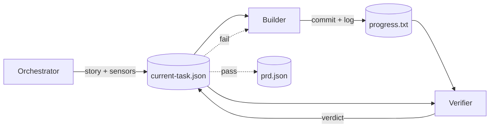

# Marmite

A small harness CLI that runs three agents in a loop to implement a project from a PRD: an orchestrator picks the next story, a builder writes the code, and a verifier reviews it. The verifier never sees the build session, it has no stake in the plan and tends to catch what's actually broken better. Every handoff goes through a zod-validated JSON file you can read, diff, and replay.

Works on greenfield projects and existing codebases.

## Quickstart

Requires [Bun](https://bun.sh) and [Claude Code](https://docs.claude.com/en/docs/claude-code).

```bash
export ANTHROPIC_API_KEY=sk-ant-...
bunx marmite init                 # interview + scaffold
bunx marmite to-prd ./PRD.md      # creates and validates .marmite/prd.json
bunx marmite cook                 # start the loop
```

## Project shape

`marmite init` interviews you, detects whether the repo is greenfield or has existing code, and wires sensors to configs already in your repo. Nothing is overwritten without asking.

```
my-project/
├── marmite.json              # config: paths, sensors, models, budgets
├── .marmite/
│   ├── prd.json              # the PRD that drives the loop          (git)
│   ├── progress.txt          # rolling story status                  (git)
│   ├── current-task.json     # per-iteration agent handoff           (git)
│   ├── prompts/              # optional prompt overrides             (git)
│   ├── events.jsonl          # per-session event log              (ignored)
│   └── feedback.md           # async notes, dropped mid-run       (ignored)
└── app/                      # your code (path is configurable)
```

## Cook

```bash
marmite cook                                          # 1000 iterations (default)
marmite cook -n 5                                     # custom iteration cap
marmite cook --prd ./x.json
marmite cook --model claude-opus-4-7
marmite cook --cost-budget 10                         # per-story cap (USD)
marmite cook --cost-budget-total 100                  # halts when total exceeded
marmite cook --builder-model claude-opus-4-7 --verifier-model claude-sonnet-4-6
```

## The loop



| Phase | Agent | Output |
|---|---|---|
| `ORCHESTRATE` | Orchestrator | Picks story, runs sensors, writes the brief |
| `BUILD` | Builder | Implements, commits |
| `VERIFY` | Verifier | Approves or rejects |
| `FIX` | Builder | Resumes the same session to address feedback |

`current-task.json` is the single handoff. If a run crashes, run `marmite cook` again: the orchestrator picks the next non-passing story, and any in-flight story without a `verify:` commit gets re-attempted.

## Async feedback

You can steer a running loop without stopping it. Drop a note any time:

```bash
echo "login UI feels cramped, add vertical spacing on the next pass" > .marmite/feedback.md
```

The next iteration folds the note into story selection and `guidance`, then deletes the file. The PRD stays untouched, so feedback shapes the upcoming pass only. The harness clears the file as a fallback if the orchestrator forgets.

## Configuration

`marmite.json` (JSONC, all fields optional):

```jsonc
{
  "app": "./app",
  "prd": "./.marmite/prd.json",

  "sensors": [
    { "name": "eslint", "type": "debt",  "package": "eslint",     "configPath": "./app/.eslintrc.json", "guidance": "Run via `bun run lint:strict`." },
    { "name": "tsc",    "type": "pulse", "package": "typescript", "configPath": "./app/tsconfig.json",  "guidance": "Use `bun run typecheck`." }
  ],

  "models": {
    "default":      "claude-sonnet-4-6",
    "builder":      "claude-sonnet-4-6",
    "verifier":     "claude-haiku-4-5",
    "orchestrator": "claude-sonnet-4-6"
  },

  "timeouts": { "build": "20m", "verify": "10m", "fix": "15m", "orchestrate": "10m" },
  "budget":   { "perStory": 15, "total": 100 },
  "retries":  { "fix": 3, "transient": 2 },
  "maxIterations": 1000
}
```

### Sensors

Deterministic checks the orchestrator runs between stories. `configPath` points at an existing config (nothing is copied); `guidance` is prose handed to the agent. Each `type` maps to a skill the orchestrator suggests to the builder on failure:

| Type | Catches | Tools | Skill |
|------|---------|-------|-------|
| `drift` | Import violations, circular deps, layer misuse | dependency-cruiser | `architect` |
| `debt` | Style, complexity, unused code, type errors | eslint, tsc | `clean-code`, `refactor` |
| `pulse` | Failing or flaky tests | jest, vitest | `debug` |
| `safe` | Known CVEs | npm audit, snyk | `security-review` |

### Custom prompts

Drop `builder-prompt.md`, `verifier-prompt.md`, or `orchestrator-prompt.md` into `.marmite/prompts/` to override the defaults. Overrides are checked in.

## Ops

- Transient errors (429, 5xx, network) retry with exponential backoff. Fatal errors abort the iteration.
- Per-story cap halts remaining fix attempts; total-run cap halts before the next iteration.
- Every protocol file lives under `.marmite/` and is written atomically (temp + rename).

## Hacking on marmite

```bash
git clone <repo> && cd marmite && bun install
```

There is no `app/` in this repo; marmite is a harness, not an application. To smoke-test, run `bunx --bun ./index.ts init` in a scratch dir (or `bun link`, then `marmite init`), then `marmite cook`.

```
src/core/        harness engine: orchestrator, session, schemas
src/cli/         CLI commands (init, cook, to-prd) and wizard
src/skills/      internal skills used by the CLI (not shipped to users)
templates/       installed into user projects by `marmite init`:
                   prompts/ goes to <project>/.marmite/prompts/
                   skills/  goes to <project>/.claude/skills/
```
